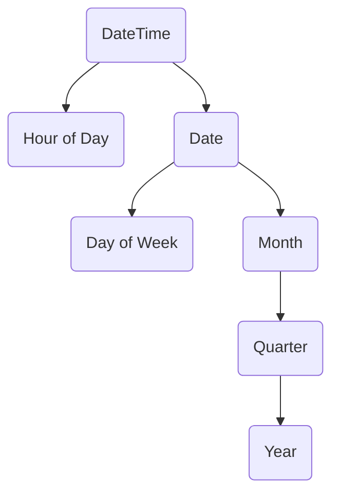

# Advanced SQL


$$
\boxed{@}
% Color %
\newcommand\c[2]{\textcolor{#1}{#2}}
\newcommand\r[1]{\textcolor{red}{#1}}
\newcommand\g[1]{\textcolor{green}{#1}}
\newcommand\b[1]{\textcolor{blue}{#1}}
\newcommand\red[1]{\textcolor{red}{#1}}
\newcommand\blue[1]{\textcolor{blue}{#1}}
\newcommand\green[1]{\textcolor{green}{#1}}
\newcommand\black[1]{\textcolor{black}{#1}}
\newcommand\white[1]{\textcolor{white}{#1}}
\newcommand\cyan[1]{\textcolor{cyan}{#1}}
\newcommand\magenta[1]{\textcolor{magenta}{#1}}
\newcommand\yellow[1]{\textcolor{yellow}{#1}}
\newcommand\orange[1]{\textcolor{orange}{#1}}
\newcommand\lime[1]{\textcolor{lime}{#1}}
\newcommand\pink[1]{\textcolor{pink}{#1}}
\newcommand\darkgray[1]{\textcolor{darkgray}{#1}}
\newcommand\gray[1]{\textcolor{gray}{#1}}
\newcommand\lightgray[1]{\textcolor{lightgray}{#1}}
\newcommand\brown[1]{\textcolor{brown}{#1}}
\newcommand\olive[1]{\textcolor{olive}{#1}}
\newcommand\purple[1]{\textcolor{purple}{#1}}
\newcommand\teal[1]{\textcolor{teal}{#1}}
\newcommand\violet[1]{\textcolor{violet}{#1}}
\newcommand\hotpink[1]{\textcolor{hotpink}{#1}}
\newcommand\blueviolet[1]{\textcolor{blueviolet}{#1}}
\newcommand\navyblue[1]{\textcolor{navyblue}{#1}}
\newcommand\peach[1]{\textcolor{Peach}{#1}}
\newcommand\orangeRed[1]{\textcolor{OrangeRed}{#1}}
\newcommand\salmon[1]{\textcolor{Salmon}{#1}}
\newcommand\skyblue[1]{\textcolor{SkyBlue}{#1}}
\newcommand\springreen[1]{\textcolor{SpringGreen}{#1}}
\newcommand\aqua[1]{\textcolor{aqua}{#1}}
\newcommand\navy[1]{\textcolor{navy}{#1}}
\newcommand\silver[1]{\textcolor{silver}{#1}}
\newcommand\fuchsia[1]{\textcolor{fuchsia}{#1}}
\newcommand\maroon[1]{\textcolor{maroon}{#1}}
\definecolor{luo}{RGB}{102,204,255}
\definecolor{miku}{RGB}{57,197,187} 
\newcommand\luo[1]{\textcolor{luo}{#1}}
\newcommand\miku[1]{\textcolor{miku}{#1}}

% Typography %
\newcommand\a[1]{\begin{aligned}#1\end{aligned}}
\newcommand\t[1]{\text{#1}}
\newcommand\tb[1]{\text{\textcolor{blue}{#1}}}
\newcommand\lb[1]{\left\{\begin{aligned} #1 \end{aligned}\right.}
\newcommand\lrb[1]{\lb{\rb{#1}}}
\newcommand\rb[1]{\left.\begin{aligned} #1 \end{aligned}\right\}}
\newcommand\env[2]{\begin{#1}#2\end{#1}}
\newcommand\step[1]{\textbf{ (#1) }}

% Misc %
\newcommand\s[1]{\{#1\}}
\newcommand\qed{\quad\square}
\newcommand\define{\dot{=}}
\newcommand\then{\implies}
\newcommand\rounddown[1]{\lfloor{#1}\rfloor}
\newcommand\roundup[1]{\lceil{#1}\rceil}
\newcommand\graph[4]{#1 = (#2, #3) \quad |#2| = #4}
\newcommand\G{G = (V, E) \quad |V| = n}
\newcommand\so{\therefore}
\newcommand\comment[1]{\quad\text{(#1)}}
\newcommand\note[1]{\quad\text{(#1)}}
\newcommand\bt[1]{\boxed{\text{#1}}}
\newcommand\max[1]{\textbf{ max } \{#1\} }
\newcommand\min[1]{\textbf{ min } \{#1\} }
\newcommand\IF{\textbf{ IF }}
\newcommand\if{\textbf{ if }}
\newcommand\IS{\textbf{ IS }}
\newcommand\is{\textbf{ is }}
\newcommand\do{\textbf{ do }}
\newcommand\dowhile{\textbf{ do while }}
\newcommand\dountil{\textbf{ do until }}
\newcommand\find{\textbf{ find }}
\newcommand\until{\textbf{ until }}
\newcommand\thereisa{\textbf{ There is a }}
\newcommand\thereisan{\textbf{ There is an }}
\newcommand\hasno{\textbf{ has no }}
\newcommand\has{\textbf{ has }}
\newcommand\but{\textbf{ but }}
\newcommand\however{\textbf{ however }}
\newcommand\AND{\textbf{ AND }}
\newcommand\OR{\textbf{ OR }}
\newcommand\NOT{\textbf{ NOT }}
\newcommand\THEN{\textbf{ THEN }}
\newcommand\IN{\textbf{ in }}
\newcommand\NOTIN{\textbf{ NOT-IN }}
\newcommand\assume{\textbf{ Assuming that: }}
\newcommand\contradictory{\textbf{ Thus lead to contradiction }}
\newcommand\proof{\textbf{Proof: }}
\newcommand\st{\textbf{ such that }}
\newcommand\hold{\text{ holds }}
\newcommand\lhs{\text{ LHS }}
\newcommand\rhs{\text{ RHS }}
\newcommand\wlg{\text{ Without loss of generality }}
\newcommand\nb{\text{ nota bene }}
\newcommand\analogously{\text{ analogously }}
\newcommand\viceversa{\textbf{ viceversa }}
\newcommand\let{\textbf{ let }}
\newcommand\as{\textbf{ as }}
\newcommand\for{\textbf{ As for }}
\newcommand\select{\textbf{ SELECT }}
\newcommand\m[1]{\mathit{#1}}
\newcommand\+[1]{\mathcal{#1}}
\newcommand\warnning[1]{\colorbox{Blue}{\textcolor{Yellow}{#1}}}
\newcommand\error[1]{\colorbox{Black}{\textcolor{White}{#1}}}
$$



## Access DB From PL

通過 `編程語言 (Programming Language)`  `訪問` `數據庫` 的方式：

- `動態SQL`：使用 `數據庫API` 來連接 `數據庫`
  - JDBC
  - ODBC
  - ADO.NET
- `嵌入式SQL`：可以將 `SQL語句` 嵌入到 `宿主語言` 中，通過 `預處理器` 對 `嵌入宿主語言的SQL` 進行 `轉化`。

---

這裏簡單地討論幾點 `JDBC` 的內容。

- 主要涉及的對象：`Connection`，`Statement`，`ResultSet`

- `JDBC` 並不是僅僅支持 `MySQL` 的，它可以 `指定` 用於 `建立數據庫連接` 的 `數據庫通信的API`：如 `jdbc:mysql`，`jdbc:oracle` 等來連接 `多種類型的數據庫`

  > 更準確地說，`JDBC` 僅 `指定通信所用的API`，而不是 `指定通信所用的協議`。因為一個`JDBC驅動器` 可能同時支持 `多種數據庫通信協議`

- `Statement` 並不是 `SQL語句對象`本身，但可以用 `Statement` 來 `執行語句`
- 使用 `PreparedStatement` 而不是 `拼接字符串的方式` 來 `構造SQL語句`！
- `數據庫` 返回的 `ResultSet` 不僅僅包含 `元組數據`，還包含許多 `元數據`。在需要時使用 `ResultSet#getMetaData` 獲得 `元數據`，而不是 `硬編碼` 它們！
- 對 `Updatable Result Set` 的 `修改性操作` 會 `反映到數據庫`
- 如果需要將 `接下來的多條SQL語句作為事務`，而不是 `每條語句都被視為獨立的事務`，則請用 `Connection#setAutoCommit(false)`


## Function and Procedure

`函數 (Function)` 和 `過程 (Procedure)` 允許 `業務邏輯` 作為 `存儲過程 ` 記錄在 `數據中`。

這使得 `業務邏輯代碼` 是 `編程語言獨立` 和 `應用獨立` 的。

### Function

- 一個簡單的 `函數` 的例子

```sql
CREATE FUNCTION dept_count(dept_name varchar(20)) RETURNS integer
BEGIN
    DECLARE d_count integer
    SELECT count(*) INTO d_count
    FROM instructor
    WHERE instructor.dept_name = dept_name
    RETURN d_count
END
```

- `帶參數的視圖 (Parameterized View)`

```sql
CREATE FUNCTION instructor_of(dept_name varchar(20)) RETURNS TABLE(ID varchar(5),
                                                                  name varchar(20),
                                                                  dept_name varchar(20),
                                                                  salary numeric(8,2))
RETURN TABLE(SELECT ID, name, dept_name, salary
             FROM instructor
             WHERE instructor.dept_name = instructor_of.dept_name
            );                                                                 
```

我們將 `這種函數` 視為 `廣義上的視圖`。

### Procedure

> 對於 `函數 (Function) ` 和 `過程 (Procedure)` 如果做 `詳細區分`，則我們這樣定義：
>
> - 函數：帶有 `返回值`
> - 過程：不帶有 `返回值`
>
> 從 `組成體系結構` 的角度看，`過程` 是比 `函數`  更加 `底層的概念`

```sql
CREATE PROCEDURE dept_count_proc(IN dept_name varchar(20), OUT d_count integer)
BEGIN
    SELECT count(*) INTO d_count
    FROM instructor
    WHERE instructor.dept_name = dept_count_proc.dept_name
END
```

> `IN` 表示 `輸入參數`，而 `OUT 表示輸出參數`。
>
> 這種形式的 `傳參方式` 在某些 `底層接口調用` 中常見。其中 `OUT` 經常傳遞的是 `指針類型`，以便 `調用者` 可以通過 `變量` 來 `接收` 到 `過程的結果` 

### Persistent Storage Module

`持久存儲模塊 (Persistent Storage Module)` ：用於處理 `構造` 

這裏不詳細討論 `PSM` 的 `語法`，只給出一個 `大號的例子`

```sql
DECLARE out_of_classroom_seats CONDITION
DECLARE EXIT HANDLER FOR out_of_classroom_seats
BEGIN
	sequence of statements
END

CREATE FUNCTION registerStudnet(
    IN s_id varchar(5),
    IN s_courseid varchar(8),
    IN s_secid varchar(8),
    IN s_semester varchar(6),
    IN s_year numeric(4,0),
    OUT errorMsg varchar(100)
	RETURNS integer
BEGIN
    DECLARE currEnrol int;
    SELECT count(*) INTO currEnrol
    FROM takes
    WHERE course_id = s_courseid AND sec_id = s_secid
    AND semester = s_semester AND year = s_year;
    
    DECLARE limit int;
    SELECT capacity INTO limit
    FROM capacity NATURAL JOIN section
    WHERE course_id = s_courseid AND sec_id = s_secid
    AND semester = s_semester AND year = s_year;
    
    IF (currEnrol < limit) 
    	BEGIN
    		INSERT INTO takes VALUES (s_id, s_courseid, s_secid, s_semester, s_year, null);
    		RETURN(0);
    	END
    -- capacity overflow !
    SET errorMsg = 'Enrollment limit reached for course' || s_courseid || 'section' || s_secid;
    RETURN(-1);
END    
)
```

### External Language Procedure

`數據庫` 可以將 `過程` 委托給 `外部語言程序` 來執行，像這樣的 `過程` 稱作 `外部語言過程`

```sql
CREATE PROCEDURE dept_count_proc(IN dept_name varchar(20), OUT count integer)
LANGUAGE C
EXTERNAL NAME '/usr/avi/bin/dept_course_proc'
```

> 如果為了 `性能` 而將 `任務` 委托給 `C` 這樣的語言，可能會導致 `安全問題`。
>
> 而如果委托給 `Java`，`C#` 這樣的語言，通過 `進程間通信` 和 `沙盒執行` 則會導致 `效率低下`。
>
> 此外，編寫能 `正確處理` `數據庫數據` 的 `外部例程` 的 `編碼量` 通常較多。

## Trigger

`觸發器 (Trigger)`：用於在 `數據庫` 發生 `指定事件` 時，`自動` 被 `執行的語句`

---

```sql
CREATE TRIGGER credits_earned AFTER UPDATE OF takes ON(grade)
	REFERENCING NEW ROW AS nrow
	REFERENCING OLD ROW AS orow
	FOR EACH ROW
	WHEN nrow.grade <> 'F' AND nrow.grade IS NOT NULL
		AND (orow.grade = 'F' OR orow.grade IS NULL)
	BEGIN ATOMIC
		UPDATE student
		SET tot_cred = tot_cred + 
            (SELECT credits
            FROM course
            WHERE course.course_id = nrow.course_id)
    	WHERE student.id = nrow.id;
    END
```

> `觸發器類型`：
>
> - `語句級觸發器 (FOR EACH STATEMENT)`：對於 `引起修改的整個SQL語句` `僅執行1次` `觸發器`
> - `行級觸發器 (FOR EACH ROW)`：對 `每個受影響的行` `都執行1次` `觸發器`
>
> `過渡變量 (Transition Variable)`：
>
> - `REFERENCING OLD ROW AS symbol`：存儲 `已經更新或刪除的行的舊值`
> - `REFERENCING NEW ROW AS symbol`：可用於 `插入` 或 `刪除` 的 `行的引用`
>
> `觸發時機`：
>
> - `BEFORE`：用於 `避免非法更新`，`附加額外約束`
> - `AFTER`：用於 `為某些修改做善後處理`，`維護某些修改性操作的合法性`

如果可以使用 `存儲過程`  的話，則盡量不要使用 `觸發器`。

## Recursive Query

`遞歸查詢 (Recursive Query)` 的典型例子是尋找 `傳遞閉包 (Transitive Closure)` ，比如 `找出某個課程的所有前置課程`。

---

尋找 `傳遞閉包`

###  Iteration

```sql
CREATE FUNCTION findAllPrereqs(cid varchar(8))
RETURN TABLE(course_id varchar(8))
BEGIN
	-- define variables
	CREATE TEMPORARY TABLE c_prereq(course_id varchar(8));
	CREATE TEMPORARY TABLE new_c_prereq(course_id varchar(8));
	CREATE TEMPORARY TABLE temp(course_id varchar(8));
	-- init and continue
	INSERT INTO new_c_prereq
		SELECT prereq_id
		FROM prereq
		WHERE course_id = cid;
	-- loop until not new course is added
	REPEAT
		INSERT INTO c_prereq
			SELECT INTO temp
			FROM new_c_prereq;
		INSERT INTO temp
			(SELECT prereq.course_id
            FROM new_C_prereq, prereq
            WHERE new_c_prereq.course_id = prereq.course_id)
            EXCEPT
            (SELECT course_id
            FROM c_prereq);
        DELETE FROM new_c_prereq;
        INSERT INTO new_c_prereq
        	SELECT *
			FROM temp;
		DELETE FROM temp;
	UNTIL NOT EXISTS (SELECT * FROM new_c_prereq)
	END REPEAT
	-- return the result table
    RETURN TABLE c_prereq;
END 
```

### Recursion

```sql
-- define recursive query
WITH RECURSIVE rec_prereq(course_id, prereq_id) AS (SELECT course_id, prereq_id
                                                   FROM prereq)
                                                   UNION 
                                                   (SELECT rec_prereq, course_id, prereq.prereq_id
                                                   FROM prereq, rec_prereq
                                                   WHERE prereq.course_id = rec_prereq.prereq_id)
-- call recursive query
SELECT *
FROM rec_prereq;
```

> 上述的SQL中，首先通過 `基查詢` 找到 `每門課程的先修課程`，然後 `遞歸查詢` 在 `每次叠代過程` 中 `增加一層課程`，直到到達 `課程-先修課程的最大層次`。

> 通過 `FROM子句` 對 `遞歸視圖 prc_prereq` 進行 `遞歸查詢`。
>
> `WITH RECURSIVE` 用於聲明 `遞歸視圖`，它會使得 `遞歸` 在到達 `不動點` 時 `自動被終止`

> `SQL標準` 要求 `遞歸過程` 返回的 `結果` 是 `單調遞增的`，並且最終到達 `不動點 (Fixed Point)`
>
> > 也就是說，每次 `遞歸過程` 返回的 `結果` 必須是 `之前的結果的超集`
>
> > 只要 `遞歸過程是遞增的`，就可以使用 `叠代過程來定義遞歸過程`。

任何的 `遞歸查詢 (Recursive Query)` = `基查詢 (Base Query)` UNION `遞歸查詢 (Recursive Query)`

## Advanced Aggregate

### Rank

#### Sparse Rank & Dense Rank

- `rank()`

``` sql
-- SQL 1
SELECT ID, rank() OVER (ORDER BY (GPA) DESC) AS s_rank
FROM student_grades
ORDER BY 's_rank'
```

> 單純的 `rank` 並不會對 `結果關系中的元組` `按rank進行排序`。
>
> 故添加 `ORDER BY 's_rank'`  來對 `結果關系的元組` 進行 `排序`

> 其他類型的 `排序函數`：`percent_rank()`，`cume_dist()`，`row_number()`

> 關於 `空值` 的處理，可以設置策略：`NULL FIRST` 或 `NULL LAST`
>
> ```sql
> SELECT ID, rank() OVER (ORDER BY (GPA) DESC NULL LAST) AS s_rank
> FROM student_grades
> ORDER BY 's_rank'
> ```

$SQL 1 = SQL 2$

```sql
-- SQL 2
SELECT ID, (1 + (SELECT count(*)
                FROM student_grades B
                WHERE B.GPA > A.GPA)) AS s_rank
FROM student_grades A
ORDER BY s_rank
```

- `dense_rank()`

`rank()` 產生的 `排名` 是 `間斷的`：如果 `分數最高的人` 有2人，則 `這兩個人的排名` 均為 `1`，但 `分數次高的人` 的 `排名` 則為 `3`

相反的，如果使用 `dense_rank()`，則產生 `不間斷` 的 `排名`：`分數最高的兩人` 排名均為 `1`，但 `分數次高的人` 的 `排名` 則為 `2`

```sql
-- SQL 3
SELECT ID, dense_rank() OVER (ORDER BY (GPA) DESC) AS s_rank
FROM student_grades
ORDER BY 's_rank'
```

####   Partition before Rank

```sql
-- SQL 4
SELECT ID, dept_name, rank() OVER (PARTITION BY dept_name ORDER BY GPA DESC) AS DEPT_RANK
FROM dept_grades
ORDER BY dept_name, dept_rank;
```

> 當存在 `GROUP BY` 時， `PARTION` 在 `GROUP BY` 之後執行。

> 可以認為，如果在 `聚集` 時沒有 `顯示地指定 PARTITION`，則認為 `將所有的集合` 分為 `唯一的一個分區`

#### Grading

 `ntile(n)` 按 `給定順序` 取得 `每個分區 (Partion) 中的元組`，然後將 `元組` 分成 `n個具有相同元組數目的桶`

```sql
SELECT ID, ntile(4) OVER (ORDER BY (GPA DESC)) AS quartile
FROM student_grades;
```

 可用於構造 `百分比直方圖`

### Window Query

`窗口查詢`：可用於對 `一定範圍內的元組` 進行 `聚集`

> 不同於 `分區查詢` 中的 `1個元組` 只對 `1個分區 (Partion)` 有貢獻，`分窗查詢` 中的 `窗口 (Window)` 是可以 `重疊的`。

```sql
SELECT year, avg(num_credits) OVER(ORDER BY year ROWS 3 PRECEDING) AS avg_total_credits
FROM tot_credits;
```

> n.b. 如果 `某個年份的元組` 具有 `多個`，則 `為某個年份到底選擇哪個元組` 將 `取決於具體實現`。

> `窗口` 的大小界定參數：
>
> - `ROWS n PRECEDING/FOLLOWING`
> - `ROWS UNBOUNDED PRECEDING/FOLLOWING`
> - `ROWS BETWEEN a PRECEEDING AND b FOLLOWING `
> - `RANGE BETWEEN a AND b `


## OLAP

### Introduction

`聯機分析處理 (OLAP)` 是一個 `交互式系統`，允許 `分析人員` 查看 `多維數據` 的 `不同種類的匯總數據`

---

假如我們有 `模式` $sales(item\_name, color, clothes\_size, quantity)$

可以對 `關系中的某些屬性`  `分組 (Group)`  為 `度量屬性` 和 `維屬性`：

- `度量屬性 (Measure Attribute)`：對 `某個值` 進行 `度量`，並且可以對 `這個值` 進行 `聚集操作`
- `維屬性 (Dimension Attribute)`：`剩余的屬性` 稱為 `維屬性`

能夠 `模式化` 為 `度量屬性` 和 `維屬性` 的 `數據` 統稱為 `多維數據 (Multi-Dimensional Data)`

---

`數據立方體 (Data Cube)`：可以用於描述 `n維數據`。

> `交叉表 (Cross-Tabulation / Pivot Table)`：可以用於描述 `二維屬性`，是 `數據立方體` 的 `2維情形`
>
> 某些 `交叉表` 可能還含有 `匯總行 (Total Row)` 和 `匯總列 (Total Column)`

`單元 (Cell)`：`n維的數據單元` 可用 `n維向量` 進行 `定位`，每個 `單元` 存儲 `1個值`

>  當 `某個維度` 的 `取值` 為 `all` 時，則表示 `對該維度的數據進行聚集`，即 `對該維度進行壓縮`！
>
>  如 `clothes_size`  的 `all值` 是對 ：`small`，`medium` 和 `large` 進行 `聚集` 得到的。

---

- Select `attribute_list`

`轉軸 (Pivot)`：改變 `交叉表` 中 `維` 的操作

`切片 (Slice) / 切塊 (Dicing)`：`固定` `某個維度`，`觀察` `其余的維度`

> 一般將 `切片` 用於 `固定1個維度`時，`切塊` 用於 `固定多個維度` 時。

- Change ` observation granularity`

`上卷 (RollUp)` ：即 `粒度變粗`

`下鉆 (Drill Down)`：即 `粒度變細`

> `較粗粒度的數據` 可以由 `較細粒度的數據` 所產生，反之則不能。
>
> 即 `高維數據` 可以產生 `低維數據`，反之不能。

一個 `屬性` 可以有不同的 `粒度`，這些 `不同粒度` 組成 `層次結構`，如 `Datetime的層次結構`：


```mermaid
graph TD;
date_time(DateTime) --> hour_of_day(Hour of Day)
date_time --> date(Date)
date --> day_of_week(Day of Week)
date --> month(Month)
month --> quarter(Quarter)
quarter --> year(Year)
```

> 當我們討論 `屬性的粒度` 時， 我們應當把 `粒度樹` `倒過來看`，這樣正好符合 `上卷` 和 `下鉆`。
>
> > 計算機的 `樹` 就是 `倒過來的自然界的樹`，而 `粒度樹` 是 `倒過來的樹`，也就正好符合 `自然界的樹`。

### OLAP in SQL

 `模式` $sales(item\_name, color, clothes\_size, quantity)$

- `pivot()`

```sql
SELECT *
FROM sales
pivot(
	sum(quantity)
    FOR color IN ('dark', 'pastel', 'white')
)
```

> `pivot中的for` 的 `語義` 是：`解包`  `指定屬性的指定值` ，將 `這些值` 作為 `新屬性` 插入。

| item_name | clothes_size | dark | pastel | white |
| --------- | ------------ | ---- | ------ | ----- |
| skirt     | small        | 2    | 11     | 2     |
| ...       | ...          | ...  | ...    | ...   |

- `cube()`

```sql
SELECT item_name, color, clothes_size, sum(quantity)
FROM sales
GROUP BY cube(item_name, color, clothes_size)
```

> 如果需要處理 `all值`，則可以使用 `decode()` 和 `grouping()`。

該查詢返回的是一個 `關系` $ (item\_name, color, clothes\_size, quantity)$

該關系表示1個 `3維的數據立方體`

- `rollup()`

```sql
SELECT item_name, color, clothes_size, sum(quantity)
FROM sales
GROUP BY rollup(item_name, color, clothes_size)
```

從 `返回的結果關系的模式` 來看，`rollup()` 和 `cube()` 返回的 `結果關系` 具有 `相同的模式`。

實際上，`rollup()` 生成的是：1個 `0維立方體`，1個 `1維立方體`，1個 `2維立方體`， 1個 `3維立方體`

> 無論是用 `cube()` 還是 `rollup()`，我們都無法 `精準控製分組的產生`，即無法 `精準指定分組具有哪些屬性`。
>
> 但我們可以通過 `HAVING子句` 來去除 `GROUP子句` 產生的 `我們不想要的分組`
