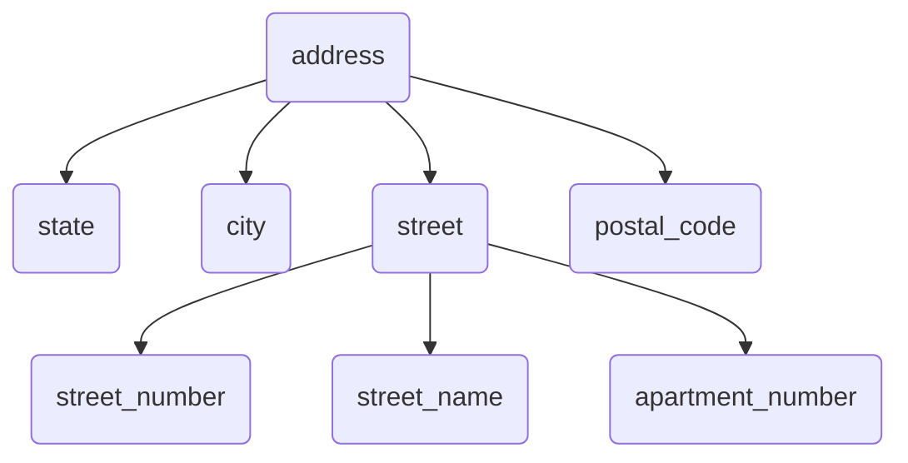
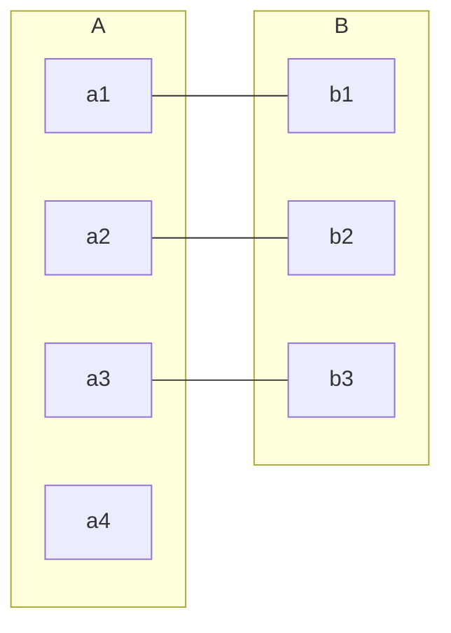
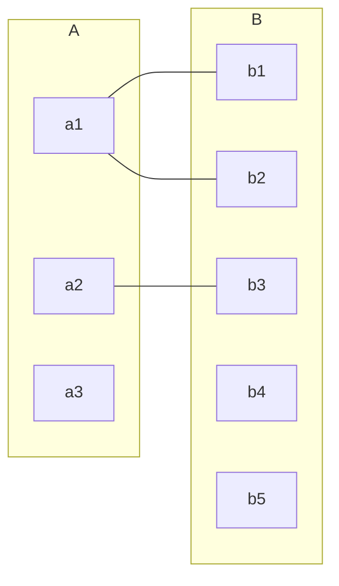
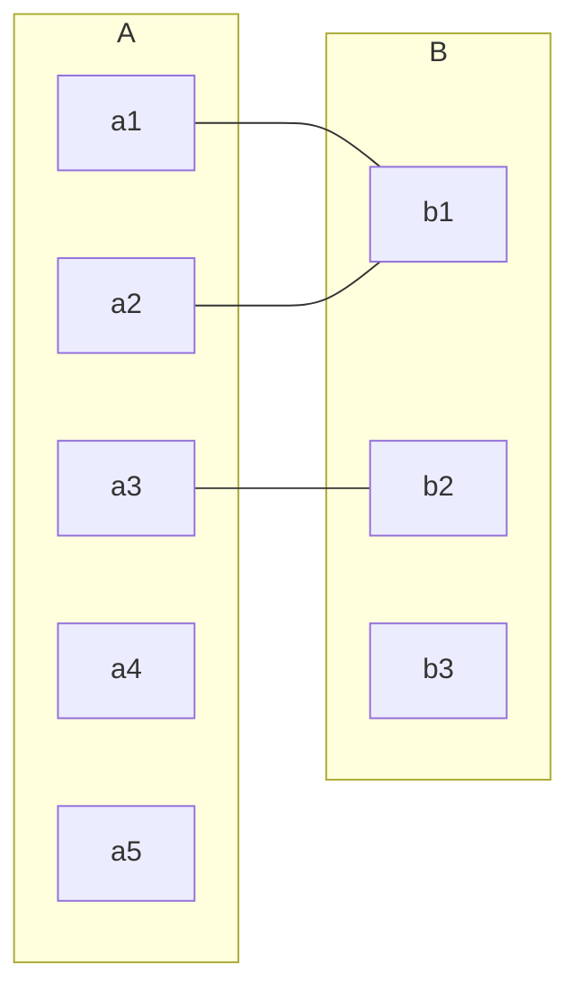
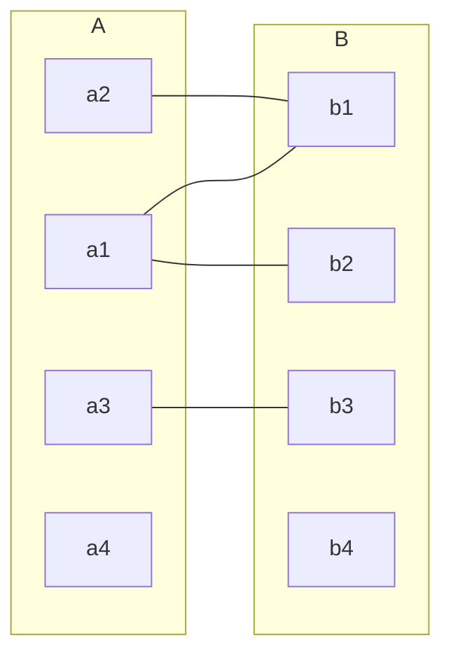

# Database Design


$$
\boxed{@}
% Color %
\newcommand\c[2]{\textcolor{#1}{#2}}
\newcommand\r[1]{\textcolor{red}{#1}}
\newcommand\g[1]{\textcolor{green}{#1}}
\newcommand\b[1]{\textcolor{blue}{#1}}
\newcommand\red[1]{\textcolor{red}{#1}}
\newcommand\blue[1]{\textcolor{blue}{#1}}
\newcommand\green[1]{\textcolor{green}{#1}}
\newcommand\black[1]{\textcolor{black}{#1}}
\newcommand\white[1]{\textcolor{white}{#1}}
\newcommand\cyan[1]{\textcolor{cyan}{#1}}
\newcommand\magenta[1]{\textcolor{magenta}{#1}}
\newcommand\yellow[1]{\textcolor{yellow}{#1}}
\newcommand\orange[1]{\textcolor{orange}{#1}}
\newcommand\lime[1]{\textcolor{lime}{#1}}
\newcommand\pink[1]{\textcolor{pink}{#1}}
\newcommand\darkgray[1]{\textcolor{darkgray}{#1}}
\newcommand\gray[1]{\textcolor{gray}{#1}}
\newcommand\lightgray[1]{\textcolor{lightgray}{#1}}
\newcommand\brown[1]{\textcolor{brown}{#1}}
\newcommand\olive[1]{\textcolor{olive}{#1}}
\newcommand\purple[1]{\textcolor{purple}{#1}}
\newcommand\teal[1]{\textcolor{teal}{#1}}
\newcommand\violet[1]{\textcolor{violet}{#1}}
\newcommand\hotpink[1]{\textcolor{hotpink}{#1}}
\newcommand\blueviolet[1]{\textcolor{blueviolet}{#1}}
\newcommand\navyblue[1]{\textcolor{navyblue}{#1}}
\newcommand\peach[1]{\textcolor{Peach}{#1}}
\newcommand\orangeRed[1]{\textcolor{OrangeRed}{#1}}
\newcommand\salmon[1]{\textcolor{Salmon}{#1}}
\newcommand\skyblue[1]{\textcolor{SkyBlue}{#1}}
\newcommand\springreen[1]{\textcolor{SpringGreen}{#1}}
\newcommand\aqua[1]{\textcolor{aqua}{#1}}
\newcommand\navy[1]{\textcolor{navy}{#1}}
\newcommand\silver[1]{\textcolor{silver}{#1}}
\newcommand\fuchsia[1]{\textcolor{fuchsia}{#1}}
\newcommand\maroon[1]{\textcolor{maroon}{#1}}
\definecolor{luo}{RGB}{102,204,255}
\definecolor{miku}{RGB}{57,197,187} 
\newcommand\luo[1]{\textcolor{luo}{#1}}
\newcommand\miku[1]{\textcolor{miku}{#1}}

% Typography %
\newcommand\a[1]{\begin{aligned}#1\end{aligned}}
\newcommand\t[1]{\text{#1}}
\newcommand\tb[1]{\text{\textcolor{blue}{#1}}}
\newcommand\lb[1]{\left\{\begin{aligned} #1 \end{aligned}\right.}
\newcommand\lrb[1]{\lb{\rb{#1}}}
\newcommand\rb[1]{\left.\begin{aligned} #1 \end{aligned}\right\}}
\newcommand\env[2]{\begin{#1}#2\end{#1}}
\newcommand\step[1]{\textbf{ (#1) }}

% Misc %
\newcommand\s[1]{\{#1\}}
\newcommand\qed{\quad\square}
\newcommand\define{\dot{=}}
\newcommand\then{\implies}
\newcommand\rounddown[1]{\lfloor{#1}\rfloor}
\newcommand\roundup[1]{\lceil{#1}\rceil}
\newcommand\graph[4]{#1 = (#2, #3) \quad |#2| = #4}
\newcommand\G{G = (V, E) \quad |V| = n}
\newcommand\so{\therefore}
\newcommand\comment[1]{\quad\text{(#1)}}
\newcommand\note[1]{\quad\text{(#1)}}
\newcommand\bt[1]{\boxed{\text{#1}}}
\newcommand\max[1]{\textbf{ max } \{#1\} }
\newcommand\min[1]{\textbf{ min } \{#1\} }
\newcommand\IF{\textbf{ IF }}
\newcommand\if{\textbf{ if }}
\newcommand\IS{\textbf{ IS }}
\newcommand\is{\textbf{ is }}
\newcommand\do{\textbf{ do }}
\newcommand\dowhile{\textbf{ do while }}
\newcommand\dountil{\textbf{ do until }}
\newcommand\find{\textbf{ find }}
\newcommand\until{\textbf{ until }}
\newcommand\thereisa{\textbf{ There is a }}
\newcommand\thereisan{\textbf{ There is an }}
\newcommand\hasno{\textbf{ has no }}
\newcommand\has{\textbf{ has }}
\newcommand\but{\textbf{ but }}
\newcommand\however{\textbf{ however }}
\newcommand\AND{\textbf{ AND }}
\newcommand\OR{\textbf{ OR }}
\newcommand\NOT{\textbf{ NOT }}
\newcommand\THEN{\textbf{ THEN }}
\newcommand\IN{\textbf{ in }}
\newcommand\NOTIN{\textbf{ NOT-IN }}
\newcommand\assume{\textbf{ Assuming that: }}
\newcommand\contradictory{\textbf{ Thus lead to contradiction }}
\newcommand\proof{\textbf{Proof: }}
\newcommand\st{\textbf{ such that }}
\newcommand\hold{\text{ holds }}
\newcommand\lhs{\text{ LHS }}
\newcommand\rhs{\text{ RHS }}
\newcommand\wlg{\text{ Without loss of generality }}
\newcommand\nb{\text{ nota bene }}
\newcommand\analogously{\text{ analogously }}
\newcommand\viceversa{\textbf{ viceversa }}
\newcommand\let{\textbf{ let }}
\newcommand\as{\textbf{ as }}
\newcommand\for{\textbf{ As for }}
\newcommand\select{\textbf{ SELECT }}
\newcommand\m[1]{\mathit{#1}}
\newcommand\+[1]{\mathcal{#1}}
\newcommand\warnning[1]{\colorbox{Blue}{\textcolor{Yellow}{#1}}}
\newcommand\error[1]{\colorbox{Black}{\textcolor{White}{#1}}}
$$



## Design Process

$$
\t{Design Process} \lb{
& \t{Design Stage} \lb{
& \t{Conceptual-Design Phase} \\
& \t{Logical-Design Phase} \\
& \t{Physical-Design Phase}
} \\

& \t{Design Choice}
}
$$

## Entity-Relationship Model

`E-R模型` 采用3個 `基本概念`：`實體集`，`聯系集`，`屬性`

### Entity-Set

`實體 (Entity)`：可區別於所有其他對象的一個對象，通過一組 `屬性` 來表示。

`實體集 (Entity-Set)`：`相同類型` 的 `實體` 的 `集合`。

### Relationship-Set

`聯系 (Relationship)`：指 `多個實體` 之間的 `相互關聯`。

`聯系集 (Relationship-Set)`：`相同類型` 的 `聯系` 的 `集合`。

- `描述性屬性 (Descriptive Attribute)`
- `度 (Degree)`：參與 `聯系集` 的 `實體集` 的 `數目`

> 練習機： 的即`實體` 之間的 `關聯` ，`實體集` $E_1, E_2,\cdots, E_n$ `參與` `聯系集` $R$
>
> `角色 (Role)`：`實體` 在 `聯系` 中扮演的 `功能`
>
> > `自環聯系集 (Recursive Relationship-Set)`：即存在 `實體集` 以 `不同的身份` 參與 `聯系` 

### Attribute

`域 (Domain)` / `值集 (Value Set)` ：`屬性` 的 `可取值集合`

`屬性` 有以下幾種 `分類方式`
$$
\t{Attribute} \lb{
& \t{Classification 1} \lb{
& \t{Simple Attribute} \\
& \t{Composite Attribute}
} \\
& \t{Classification 2} \lb{
& \t{Single-Valued Attribute} \\
& \t{Multi-Valued Attribute}
} \\
& \t{Derived Attribute}

}
$$

#### Single Attribute & Composite Attribute

`復合屬性 (Composite Attribute)` 由 `簡單屬性 (Simple Attribute)` 所組成。

> 實際上，`同樣的概念` 可能是 `復合屬性` 也可能是 `簡單屬性`，這取決於 `具體需求`。
>
> 同理，對於 `單值屬性` 和 `多值屬性` 也有類似的情況。

#### Single-Valued Attribute & Multi-Valued Attribute

`多值屬性` 使用 `花括號` 包圍 `屬性名`：$\s{phone\_numer}$

| id   | name  | phone_number                                  |
| ---- | ----- | --------------------------------------------- |
| 1    | Alice | 12345678901 12345678902 12345678903 |
| 2    | Bob   | 12345678904                                   |
| ...  | ...   | ...                                           |

####  Derived Attribute

`派生屬性 (Derived Attribute)`  可以通過 `其他屬性` 導出。

如 `age` 可以通過 `birthday` 導出。

### Constraint

`約束 (Constraint)` 是 `數據庫中的數據` 必須要滿足的 `條件`

#### Mapping Cardinality

`映射基數 (Mapping Cardinality)` 用於表示 一個 `實體` 通過 一個 `聯系集` 所 `能能關聯的實體個數`。

常見的 `映射基數`  如下：

- `one-to-one`

- `one-to-many`

- `many-to-one`

- `many-to-many`

> n.b. `一` 只能表示 `確切地要有1個實體`，而 `多` 可以是 `零個或多個實體`。
>
> 這裏所說的 `實體個數` 都是 `至多的實體個數`

#### Participation Constraint

$$
\t{Participation Constraint} \lb{
& \t{Total Participation} \\
& \t{Partial Participation}
}
$$

`全部參與 (Total Participation)`： `實體集` $E$ 的 `每個實體都參與`  到 `聯系集`  $R$ 的 `至少一個聯系` 中。

`部分參與 (Partial Participation)`：`實體集` $E$ 中 `只有部分實體參與 ` 到聯系集` $R$ 的 `至少一個聯系` 中。

#### Key

##### Identify entity

`碼/關鍵字 (Key)` 用於在 `實體集` 中 `唯一地標識`  某個 `實體`。

> 可以用 `關系模式` 中的 `超碼`，`主碼`，`候選碼` 等概念應用於 `實體集`

我們使用 `主碼` 來區別 `實體`

##### Identify Relationship

同理，我們也用 `主碼` 來在 `聯系集` 中 `區分` `聯系`。

設 `主碼` $E_i$ 表示 `構成實體集` $E_i$ `的主碼的屬性集合`。

`聯系集的主碼` 構成依賴於 `與之相同的聯系集` $R$ `所相關聯的屬性結合`：

- 若 `聯系集` $R$ 沒有 `屬性` 與之相 `關聯`$\implies primary-key(E_1) \cup primary-key(E_2) \cup\cdots \cup primary-key(E_n)$
- 若 `聯系集` $R$ 有 `屬性` $a_1, a_2,\cdots,a_m$ 與之相 `關聯` $\implies primary-key(E_1) \cup primary-key(E_2) \cup \cdots \cup primary-key(E_n) \r{\cup \s{a_1,a_2,\cdots, a_m}}$

> 考慮 `student` 和 `instructor` 的 `二元聯系 advisor`：
>
> - 從student到instructor是 `多對一` 的：`advisor的主碼` 選用 `student的主碼` 
> - 從student到instructor是 `一對多` 的：`advisor的主碼` 選用 `instructor的主碼`
> - 從student到instructor是 `一對一` 的：`advisor的主碼` 選用 `student的主碼` 或者 `instructor的主碼` 都可以。
> - 從student到instructor是 `多對多` 的：`advisor的主碼` 選用 `student的主碼` 和 `instructor的主碼` 的 `並集` 

 

## E-R Diagram

### Definition

`E-R圖` 的 `主要構件 (Component)`：

- `分成兩部分的矩形`：表示 `實體集`
- `菱形`：表示 `聯系集`
- `未分隔的矩形`：表示 `聯系集的屬性`
- `線段`： `連接` `實體集` 和 `聯系集`
- `虛線`： `連接` `聯系集的屬性` 和 `聯系集`
- `雙線`： 表示 `實體` 在 `聯系集` 中的 `參與度`
- `雙菱形`： `連接` `弱實體集` 的 `標誌性聯系集`

#### 

### Weak-Entity Set

`弱實體集 (Weak Entity Set)`：沒有 `足夠的屬性` 以形成 `主碼` 的 `實體集`

`強實體集 (Strong Entity Set)`：有 `主碼` 的 `實體集`

---

`弱實體集` 必須 `依賴於` `標識實體集 (Identifying Entity Set) / 屬主實體集 （Owner Entity Set)`，而我們將建立這種依賴的 `聯系` 稱為 `標識性聯系 (Identifying Relationship)`

`標識性聯系` 具有如下特點：

- 從 `弱實體集` 到 `標識實體集` 是 `多對一` ，且 `弱實體集`  在 `標識性聯系` 中是 `全部參與的`
- 沒有 `描述性屬性`

---

`弱實體集的分辨碼 (Discriminator) / 部分碼`：用於 `區分` `依賴於特定強實體集`的 `弱實體集` 。

> `弱實體集的主碼` = `強實體集的主碼` + `弱實體集的分辨碼`

> 如果 `弱實體集` 僅在 `單個地方` 被使用到，則可以考慮將 `弱實體集` 直接 `編碼` 為 `屬主實體集` 的 `一個屬性`。

`弱實體集` 的 `繪圖規則`：

- `弱實體集的分辨符` 使用 `虛下劃線` 表示
- `關聯` `弱實體集`  和 `強實體集` 的 `聯系集`  應當用 `雙菱形` 表示
